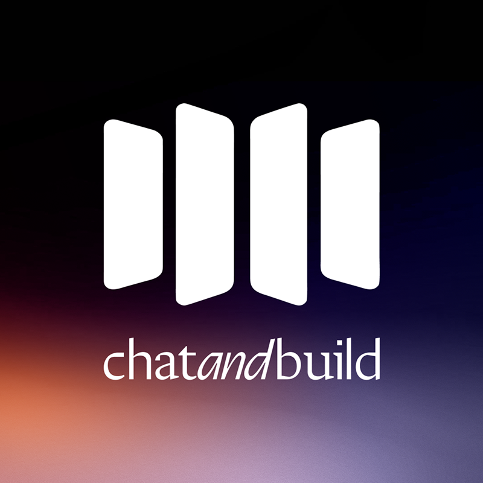

<p align="center">
  
</p>

<p align="center">
  <a href="https://linkedin.com/in/sidharthrajesh2004"></a>&nbsp;
  <a href="mailto:sidharthrajesh@gmail.com"></a>
</p>

<br/>

```console
sidharth@github:~$ cat about.md
```

> I build things at the intersection of **software engineering** and **human impact** — from full-stack web platforms to AI-powered tools. Currently on the Engineering & Data team at **ChatAndBuild**, studying Information Systems at **Singapore Management University**.

<br/>

## `> ls tech-stack/`

<table>
  <tr>
    <td align="center" width="110">
      
      <br/><sub><b>Python</b></sub>
    </td>
    <td align="center" width="110">
      
      <br/><sub><b>JavaScript</b></sub>
    </td>
    <td align="center" width="110">
      
      <br/><sub><b>HTML</b></sub>
    </td>
    <td align="center" width="110">
      
      <br/><sub><b>CSS</b></sub>
    </td>
    <td align="center" width="110">
      
      <br/><sub><b>React</b></sub>
    </td>
    <td align="center" width="110">
      
      <br/><sub><b>TypeScript</b></sub>
    </td>
  </tr>
  <tr>
    <td align="center" width="110">
      
      <br/><sub><b>Express.js</b></sub>
    </td>
    <td align="center" width="110">
      
      <br/><sub><b>FastAPI</b></sub>
    </td>
    <td align="center" width="110">
      
      <br/><sub><b>MongoDB</b></sub>
    </td>
    <td align="center" width="110">
      
      <br/><sub><b>SQL</b></sub>
    </td>
    <td align="center" width="110">
      
      <br/><sub><b>Jira</b></sub>
    </td>
    <td align="center" width="110">
      
      <br/><sub><b>Git</b></sub>
    </td>
  </tr>
</table>

<br/>

## `> cat experience.log`

<table>
  <tr>
    <td width="64" align="center">
      
    </td>
    <td>
      <b>Software Engineer Intern</b> &nbsp;·&nbsp; <a href="https://chatandbuild.com">ChatAndBuild</a>
      <br/>
      <sub>Building AI-powered tools for ChatAndBuild</sub>
    </td>
  </tr>
  <tr>
    <td colspan="2">
      
    </td>
  </tr>
</table>

<br/>

## `> cat featured-project.json`

<table>
  <tr>
    <td>
      <h3>&#x1F3C6; Maritime Voyage Optimisation Platform</h3>
      <p>
        
        
      </p>
      <p>
        Optimised vessel-cargo assignments using the <b>Hungarian algorithm</b> to maximise a <b>USD 5.8M portfolio</b> across 15 vessels and 11 cargoes, with real-time TCE calculations and sensitivity analysis on bunker prices and laytime.
      </p>
      <p>
        Architected a freight analytics platform with <b>FastAPI</b> and <b>React/TypeScript</b> alongside an agentic AI chatbot for voyage economics. Trained a <b>LightGBM</b> port-delay model hitting <b>99.7% accuracy</b> (MAE 0.064 days) on 26 engineered features across Asia's six busiest ports.
      </p>
      <p>
        
        
        
        
        
      </p>

    </td>
  </tr>
</table>

<br/>

## `> echo $CONNECT`

```
                                        
  Got an interesting project or idea?   
  Let's build something together.       
                                        
```

<p align="center">
  <a href="https://linkedin.com/in/sidharthrajesh2004">
    
  </a>
</p>

<br/>

## `> run contribution.snake`

<p align="center">
  
</p>

<br/>

<p align="center">
  
</p>
